<p align="center">
  
</p>

# What is THEOS?

**THEOS** is a prebuilt image for the **Banana Pi M2 Zero** and the **Orange Pi Zero 3**. It includes essential pre-configurations and software for running **Klipper firmware** with **Mainsail** as the user interface to control your **T100** or **T250** 3D printer.


## Features

### **Automatic TMC Driver tuning**

The TMC Driver Modules of Klipper have been completely redesigned from the ground up with the goal that each driver can now tune itself automatically using just a few key parameters. In essence, the TMC Tuning Sheet has been directly integrated into Klipper.

**Example Configuration:**
<p align="left">
   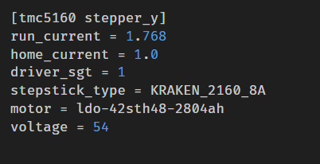
</p>

The new TMC Driver Modules introduce three new parameters:
- `stepstick_type`: Used to lookup the sense resistors for a variety of board types
- `motor`: Used to retrieve all necessary motor parameters from our motor database
- `voltage`: Specifies the PSU voltage driving the stepper drivers.

**Key Features:**

- **Dynamic Adjustment:**
   The TMC Driver Modules now dynamically adjust their parameters in real time based on the motor's current settings. For example, during sensorless homing, when the current drops, the driver recalculates all motor parameters instantly to ensure lower noise and there enhance the stability of the homing process. This eliminates common issues like unreliable homing or motor stalls during current changes.<br><br>

- **Customizable Flexibility:**
   While automation is a core feature, you still retain full control. Lock specific parameters like `driver_tbl` or `driver_toff` to values of your choice, and the driver will adjust the other parameters base on you fixed values<br><br>

- **Full Integration with THEOS Configuration**
   All supported Printers of THEOS are and their configuration are based on TMC Auto tuning. So if you're planning to build a T100 or a T250 printer you will get this feature out of the box<br><br>

**Comparison Automatic Driver Tuning v.s. Stock Klipper Module**

Here’s an example of the sine wave generated by the TMC5160 Stepper Driver when using Klipper’s mainline TMC drivers. This particular demonstration was recorded with measurements from Moons CSE14HRA1L410A Pancake motors. The same behavior can be observed across all low-inductance and low-resistance motors, such as the ACTs, 2504, 2804, or Leadshine models:

<p align="center">
   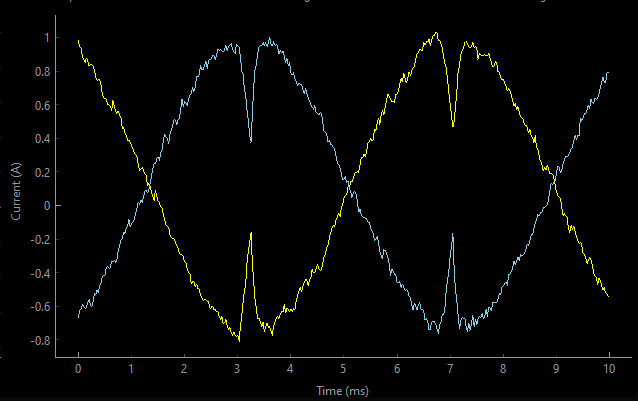
</p>

As you can see Mainline Klipper cuts the power at the sine peak, it results in poor motor performance, causing:

- Higher temperatures are inevitable because you'll need to increase the `run_current` for your motors to compensate for power loss. Without this adjustment, even your high-end, expensive motors could end up underperforming compared to an average $5 motor you’d find on AE.
- The **VFAs**  that everyone complains about are another side effect. While it’s often said that faster motors inherently produce worse VFAs, that’s only half the story. The primary source of it is the global scaler used by Klipper, which reduces the power of the sine wave. This results in poorly shaped sine waves, leading directly to VFAs.Motors that are recommended by the Community that should create less VFAs are simply motors where the Inductance and the Resistance is bad enough that the global scaler doesn't limit their current as much. With a proper generated sine wave in the first place, not only is the performance of your steppers significantly improved, but VFAs are also reduced to a minimum.
- To combat the effects of bad sine waves and the resulting VFAs, many people increase the chopper frequency to 40–60kHz or even higher. While this can minimize VFA issues, it comes at a cost: a 20–30% reduction in torque. To make up for this lost torque, higher `run_current` is again required, further adding to heat generation and noise.

With all the workarounds required to achieve decent performance from fast motors like the LDO 2804 on stock Klipper, communities have started water-cooling their stepper motors. This extra cooling is needed to prevent torque loss caused by heat buildup.

Here's how a proper sine wave looks like generated by the **Automatic TMC Driver tuning**:

<p align="center">
   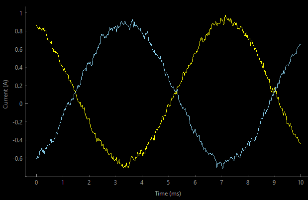
</p>

As you can see, there’s still a bit of jitter in the sine wave, but unlike with mainline Klipper, there’s no current drop at the peaks of the sine wave. This improvement results in several key benefits:

- **Increased Torque**: A proper sine wave can boost the torque of low inductance/resistance motors by 15–60%, depending on the specific motor used.
- **Reduced VFAs and Lower Chopper Frequencies**: The optimized algorithm allows for lower chopper frequencies without introducing VFAs. This translates to more torque, higher pushing forces, and increased maximum acceleration.
- **Less Vibration**: A clean sine wave minimizes vibrations generated by the motor. These vibrations, which are transferred through the belts to the gantry, are significantly reduced, addressing a major cause of blocking during high-acceleration prints.
- **Reduced run_Current**: Achieving the same motor performance now requires less run_current. For example, during my initial tests on the T250, I needed a run_current of 2.90A to achieve speeds of 1000mm/s at 150,000mm/s² acceleration. With **Automatic TMC Driver Tuning** integrated into THEOS, I was able to replicate the same performance at just 1.75A. While the first configuration overheats the motors within 15–20 minutes without active cooling, the optimized setup can run continuously 24/7 without exceeding body temperatures.

Here's an example video showcasing what 4x LDO 2804 motors can achieve when finely tuned:

<p align="center">
   <a href="https://www.youtube.com/shorts/6H1LkEzcJpI">
   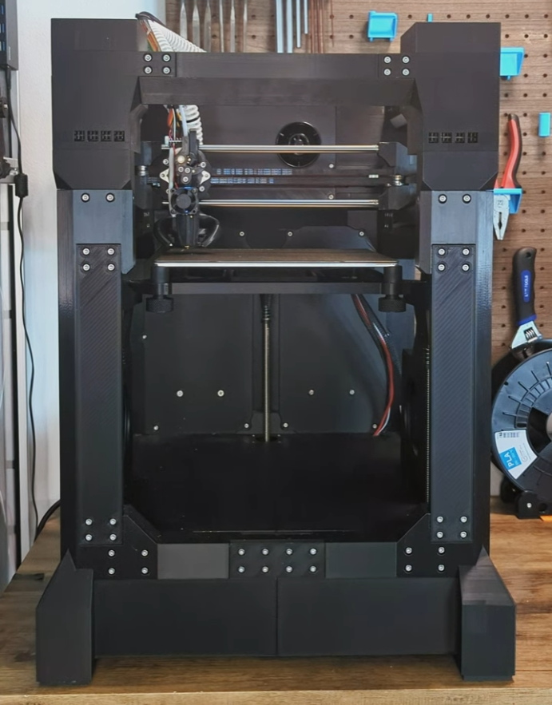
   </a>
</p>

Also here's an example of a tuned driver for sensorless sensorless homing:

<p align="center">
   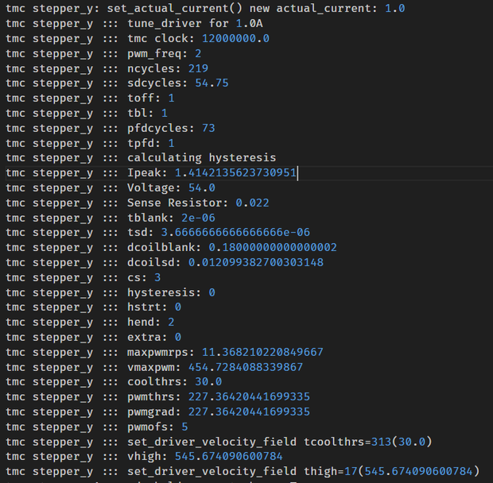
</p>

### **Enhanced Klipper Config Parser**

I'm a big fan of modular Klipper configurations, like the implementation of [Klippain](https://github.com/Frix-x/klippain) or [RatOS Configuration](https://github.com/Rat-OS/RatOS-configuration). When I started developing THEOS, I initially considered integrating my printers' configurations into one of these systems. But I quickly realized that working with their codebases just didn’t made me happy.

As a software developer, I found the codebases too "noisy," difficult to read, and exhausting to work with for extended periods. Let me be clear—both modular approaches are impressive and serve their purpose well. However, the tools they rely on are too basic to meet my standards.

That’s why I decided to improve the foundational tools first and then build my own modular configuration system on top of them. This journey led me to write most parts of the Klipper Config Parser from scratch. It was a challenge, but totally worth it.

Here’s a quick overview of what the new config parser can do:

- **`[constants]` Namespace**
The purpose of the `[constants]` namespace is to provide a central place for defining and configuring core parameters. This approach moves us away from using _USER_VARIABLE namespaces, which became a workaround standard outside of THEOS for macro development:<br><br>

   <p align="left">
      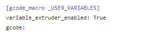
   </p>

   **Why move away from _USER_VARIABLE?**

   Variables defined in USER_VARIABLE were only available inside macros, which limited their scope and flexibility. <br><br>

- **Reference Interpolation**
   To solve the issue of needing certain values outside of macros, I decided to give the Config Parser the ability to reference config values directly:<br><br>

   <p align="left">
      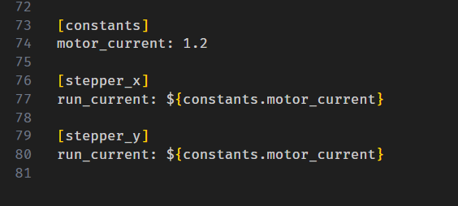
   </p>

   This means you can now assign properties by pulling in values from other sections or other properties.<br><br>

- **Reference Includes**
   I’ve enhanced the existing reference interpolation logic so that it can be used anywhere in the configuration—even in include statements:<br><br>

   <p align="left">
      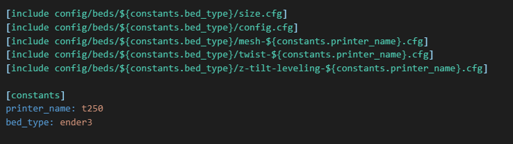
   </p>

    For instance, you can now use constants to load the correct bed configuration for your printer. The Config Parser resolves these variables when loading includes. It doesn’t matter where the constants are defined—the parser is smart enough to figure it out.<br><br>

- **Conditional Includes**
   To push the idea further, I thought it’d be cool if an include could decide whether it should be loaded or not. Now, you can use conditional logic in your config to include a file only when certain conditions are met:

   <p align="left">
      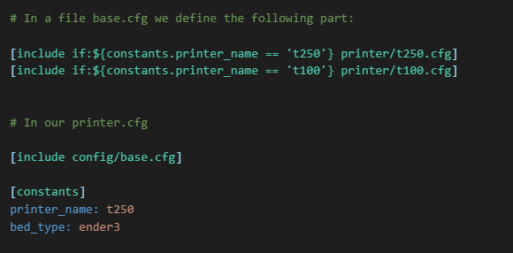
   </p>

   In this Example only **printer/t250.cfg** will be loaded since the expression for the t100 is **false**.

   This allows you to get rid definitions you might have seen in template files in other projects (e.g., klippain or rat_configuration):<br><br>

   <p align="left">
      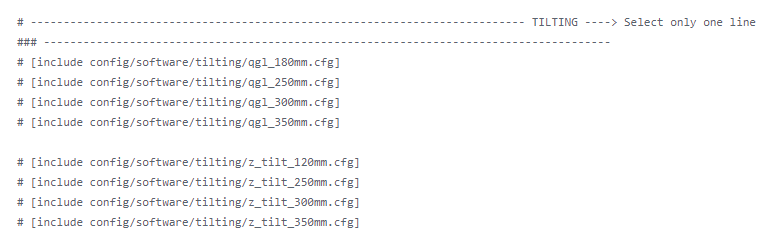
   </p>
   

   With my parser, the code can be made smarter and more readable:<br><br>

   <p align="left">
      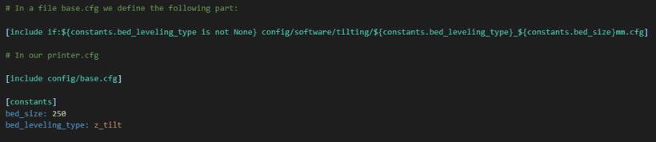
   </p>

   Plus, if there’s an error (for example, if a user sets a bed_size for which no configuration file exists), the parser will throw a clear error message telling you which file it couldn’t find.<br><br>

- **Default values**

   When making functionality optional, it's crucial to ensure the configuration doesn't have loose ends that could lead to bugs or critical errors. To address this, I implemented default values in the parser. These defaults are automatically applied whenever a referenced variable is missing, ensuring smooth operation without unexpected issues:<br><br>

   `x_start: ${constants.endstop_min_x} + ${constants.probe_offset_x:0}`<br><br>
   
   If `probe_offset_x` isn’t defined—perhaps because you don’t use a probe and haven’t included the probe configuration in your `printer.cfg` the parser will default to `0` instead of throwing an error due to the unresolved `probe_offset_x` variable. <br><br>

- **Value Overwrites**

   There are scenarios where you want to provide the user with a solid starting value—like for `pressure_advance`—while ensuring they can fine-tune it for their specific printer. At the same time, it's important to preserve the modularity of the configuration. To handle this, the config parser follows a clear rule: constants defined in `[constants]` within the `printer.cfg` file always take precedence over those defined in included files.<br><br>

- **Arithmetic Expressions**

   Macros are often overloaded in Klipper to adjust call parameters depending on variables. Here's an example from Klippain:<br><br>

   <p align="left">
      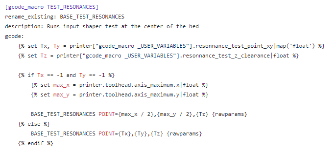
   </p>

   What the new `TEST_RESONANCES` does is automatically set the value of **POINT** to the center of the print bed if we don't overwrite it with a user variable. If the TEST_RESONANCES macro in Klipper changes in the future, it could make our macro override incompatible. Many of us experienced this during the update to Klipper 0.12 when **cruise_ratio** replaced **max_accel_to_decel**. So, what would a more robust version look like?<br><br>

   <p align="left">
      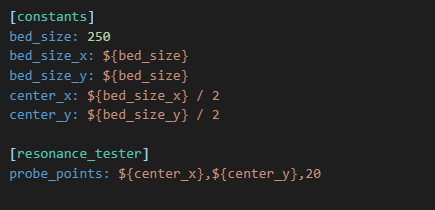
   </p>

   As you can see, overloading with my ConfigParser adjustments is no longer necessary. The new parser now supports basic arithmetic operations (+, -, *, /) and automatically calculates these for us when loading the configuration. It is also possible to reference variables in the calculations to dynamically compute values.<br><br>

   Another great example would be this one:<br><br>

   <p align="left">
      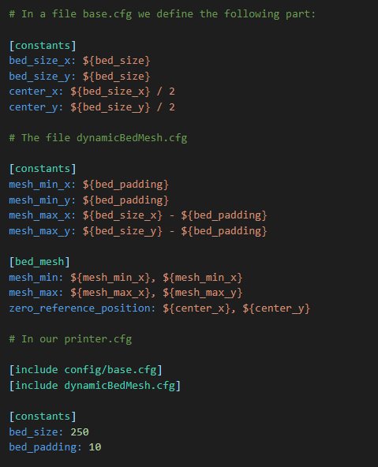
   </p>
   
   This config snippet automatically calculates the size of the bed mesh based on the size of the bed and a defined padding. The great thing about this is that the calculation happens when the config is loaded, meaning the entire dynamic process doesn’t cost us any CPU time. Compared to the macro approach, which is evaluated at the time of execution, our version is faster. The loaded config looks like this for Klipper:<br><br>

   <p align="left">
      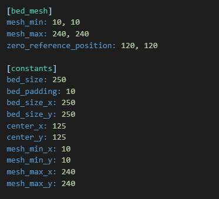
   </p>

- **Arithmetic Built-Ins** 

   There are situations where simple mathematical expressions just aren't enough to solve the problem effectively. To address this, I decided to introduce a set of powerful and practical enhancements to the arithmetic expressions, making them more versatile and capable of handling complex scenarios: <br><br>

   - **Min/Max Operations**: Constraining values within defined limits.
   - **Abs/Round Operations**: Supporting additional mathematical functions for greater flexibility and precision.<br><br>

All of this together enables entirely new ways of modularizing printer configurations. We no longer need to use crude constructs like the user templates from Klippain, nor do we need to overload every onboard macro from Klipper to incorporate our configuration modules into the macro. Most importantly, it allows us to remove many of these macros and replace them with simple property manipulations.

This makes the configuration more maintainable, as well-written configurations clearly state what they do at first glance.
   
### **THEOS Architecture**

THEOS introduces a streamlined and automated update process designed for both software and firmware, integrated seamlessly into the MainsailOS builder. This system ensures hassle-free management of key components like THEOS, Klipper, Moonraker, and managed firmware boards.


**Overview of Update Process:**

<p align="left">
   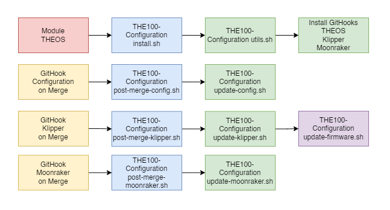
</p>


**Update Management**
The update process is based on added Git hooks that monitor updates for Klipper, Moonraker, and configurations. Post-update, scripts run to maintain consistency across all modules, allowing seamless integration with the standard Mainsail update process while integrity of all modules


**Log File Management**

THEOS includes a centralized logging system for improved debugging and issue tracking, accessible directly through the Mainsail UI. In your printer configuration folder, you’ll find a new `logs` directory containing a `theos.log` file. This log file provides detailed and readable records of all key events within THEOS, making it easier to identify and resolve issues.

To address the problem of excessive log file sizes, such as `klipper.log` and `moonraker.log` growing to several gigabytes over time, THEOS now automatically clears logs on firmware restart. Since most relevant log data occurs between restarts, this change retains critical error-tracing capabilities while ensuring your system remains clean and efficient.

**Example theos.log:**
<p align="center">
   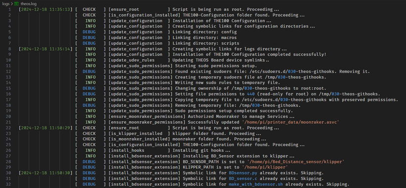
</p>

### **Native Sensorless Homing**

THEOS was designed with Sensorless Homing in mind an has there a handful of very useful optimisations when it comes to Sensorless Homing on the TMC5160 Drivers. Here's an overview of the Homing Sequence:

- **Standardized Acceleration**
Every step of the process is performed with an acceleration of 10,000 mm/s². This ensures consistency across various printer configurations.

- **Sensorless Homing for X/Y**
With the improvements of my tmc driver tuning, the impact during X/Y sensorless homing is drastically reduced. If you Listen closely to the sound when the axes hit their limits: the impact is almost inaudible for X and noticeably softer for Y compared to standard Klipper sensorless homing with TMC5160 drivers.

- **BD Sensor Homing for Z**
Using a distance sensor allows us to home the Z-axis quickly without risking a nozzle crash into the bed. I’ve implemented a two-pass homing system:
   - **Pass 1**: The Z-axis homes 3 mm above the bed at a z-speed of 15 mm/s.
   - **Pass 2**: The Z-axis then moves from 3 mm to 1 mm at a slower speed of 2 mm/s for precise homing.

- **Basic Z-Tilt Alignment**
Next, the printer aligns the bed to within approximately 1 mm tolerance. This step prevents any risk of bed scratches during the following processes.

- **Twist Compensation**
Once the bed is roughly leveled, the printer performs twist compensation. This corrects for distortions in the X or Y axes caused by shrinkage, warping, or other frame-related issues. While this improves print quality, it’s important to note that twist is one of the biggest challenges for speed and acceleration. A warped frame remains a limitation, but this process minimizes its impact on the print.

- **Z-Tilt Refinement**
After twist compensation, another Z-tilt alignment is performed to account for any bed misalignment introduced by the twist adjustment.

- **Nozzle Collision Auto-Z Calibration**
With the bed fully leveled, the printer determines the Z-offset using a combination of nozzle collision detection and the BD sensor. The nozzle slowly moves toward the bed while the sensor continuously measures the distance, stopping when no further distance change is detected.

- **Adaptive Bed Mesh**
Based on the size of the first layer of the print, Klipper generates a bed mesh that’s only as large as necessary. This saves time while allowing for more detailed mesh points. For a full bed, I use a 32x32 grid (approximately 1,000 points). In smaller prints, for example a 3D-Benchy, only an 8x6 grid will be used.

- **Prime Line**
To combat any potential nozzle oozing, the homing sequence ends with a prime line. This over-extruded line removes any residual material by binding it to the line itself.

- **Final Step**
The acceleration is reset to the printer’s standard printing acceleration. With the new acceleration the TMC Drivers get tuned for the target run_current that will be used for this print. Finally, the nozzle performs an ARC move (a circular motion) away from the prime line, ensuring that any remaining oozing filament is cleanly detached.


### **Enhanced Klipper Freatures**

- **Optional MCU Support**
   I’ve added support for defining MCUs as optional in the configuration. Optional MCUs can be connected or disconnected without restarting Klipper. For example, you can keep a portable input shaper board defined in printer.cfg and disconnect it whenever needed—seamlessly.

- **Plugin-Friendly Klipper**
   Klipper typically flags itself as -dirty when modifications are detected, which can lead to issues. To solve this, I’ve introduced a plugins directory for customizations. When Klipper starts, it merges the main directory with the plugin folder, prioritizing files from the plugin directory. This approach keeps Klipper’s integrity intact while supporting extensive modifications.

- **Reload Macros Command**
   Developing macros in Klipper can be tedious because every change requires a firmware restart. I’ve added a RELOAD_GCODE_MACROS command that reloads macro changes without restarting the firmware. This preserves the printer’s current state, allowing you to instantly test changes without re-homing or re-leveling.

- **Auto Reload Module**
   I developed a small yet powerful Klipper module that, combined with my existing RELOAD_GCODE_MACROS function, makes Rapid Macro Development possible. Simply add the `[auto_reload]` section to your Klipper configuration to load the module. Once set up, it automatically watches for changes in your printer.cfg file. The moment you save your changes, it triggers `RELOAD_GCODE_MACROS` to reload the configuration on the fly. This means no more manually restarting Klipper or reloading macros—just tweak, save, and see your updates in action immediately.


### Supported Hardware
- **BananaPI M2 Zero Image Based on Armbian/Bookworm**
- **OrangePI Zero 3 Image Based on Armbian/Bookworm**
   My primary goal with THEOS has always been to maintain simplicity and efficiency. THEOS is based on a fork of MainsailOS, which is a multi-distribution foundation (OrangePI-OS, Armbian OS, and Raspi-Lite-OS), which introduced potential sources of errors and made support more complex. To optimize the development workflow and reduce complexity, I decided to remove OrangePI-OS and now base the OrangePI Zero 3 image exclusively on Armbian/Bookworm. This change ensures a more stable and maintainable build environment, enhancing overall reliability and compatibility.
- **Experimental Support for Raspberry Pi 3/4/5**
   I know that many of you have unused Raspberry Pi units lying around, so I’ve expanded THEOS to support Raspberry Pi models 3, 4, and 5. While this is great for leveraging existing hardware, it does come with some caveats. These devices rely on proprietary bootloaders and network drivers, which are less stable compared to the open-source alternatives used by Banana Pi or Orange Pi boards.
   Additionally, the Raspberry Pi Foundation has adopted Linux Kernel 6.6, which is not yet officially supported by Debian Bookworm. This introduces a risk: any update to the OS (`apt-get`) could potentially introduce an incompatible dependency, rendering your printer’s operating system unusable and potentially irrecoverable.
   Despite these challenges, this expansion opens the door for a broader user base to make use of their existing hardware while taking advantage of THEOS’s enhanced features. Just keep these limitations in mind, it will explode it's only a matter of time! ;-)


## Installation Guide

#### What You Need

To install THEOS, you’ll need:
- An **SD card reader**
- An **SD card** with at least **32 GB** of space

#### Flashing THEOS

1. **Download and install the [Raspberry Pi Imager](https://www.raspberrypi.com/software/)**  
   Compatible with Windows, Linux, and MacOS.

2. **Download the latest [THEOS release](https://github.com/MSzturc/THEOS/releases/latest)**  
   Versions are available for both the Banana Pi M2 Zero and the Orange Pi Zero 3.

3. **Prepare the SD Card:**
   - Open **Raspberry Pi Imager**.
   - Click on **"CHOOSE OS"**, scroll to the bottom, select **"Use custom"**, and locate your downloaded THEOS file.
   - Click on **"CHOOSE STORAGE"**, then select your SD card. **Warning:** All data on the card will be erased.
   - Proceed with **"Next"**. When prompted for OS customization, select **"NO"**, and confirm the warning.

4. **Write the Image:**  
   The process will take some time. Once complete, you’ll receive a success message.


## Initial Network Setup

#### For Wired Connections
No additional steps are required. Proceed to the next section.

#### For Wi-Fi Connections
1. After flashing THEOS, unplug and replug your SD card reader. Access the **FAT boot partition** via your file manager.
2. Locate the `headless_nm.txt.template` file. Copy it and rename it to `headless_nm.txt`.
3. Open the `headless_nm.txt` file with a text editor that allows you to save it in a UNIX compabible format (e.g. Visual Studio Code) and follow the instructions in the comments to configure your network. A valid configuration might look like this:

   ```plaintext
    SSID="FRITZ!Box 3280"
    PASSWORD="123456789012345"
    HIDDEN="false"
    REGDOMAIN="DE"
## First Boot

1. Insert the prepared SD card into your 3D printer.
2. Connect necessary peripherals (e.g., network cables, webcams, USB cable to the printer).
3. Power on the device and wait up to **5 minutes** for the boot process to complete.
4. Access THEOS via your browser at:
   - [http://theos.local](http://theos.local)
5. If you are using THEOS for the first time, you may encounter the following red error message: `Klipper reports: ERROR: mcu 'mcu': Unable to connect`. That's okay, follow the instructions in the **Flashing Firmware** chapter to resolve this issue.

## Flashing Firmware

In THEOS, **Managed Devices** streamline the integration and maintenance of hardware components such as MCUs by automating firmware updates and ensuring compatibility with Klipper updates. This chapter guides you through the process of registering a 3D printer controller board, using the BTT Kraken as an example of a Managed Device. By following this process, you will enable seamless firmware management and enhance overall system stability.

Additionally, if you are using other MCU devices, such as an input shaper board, the main steps of this guide will remain the same. However, certain hardware parameters in Step X may differ. Please refer to the manufacturer's firmware flashing guide to obtain the specific hardware parameters required for your device.

1. **SSH into THEOS**
Use the following credentials to establish an SSH connection:
   - **Hostname:** `pi@theos.local`
   - **Password:** `armbian` *(or `raspberry` if you're using an RPI based SoC)*

   On MacOS / Unix: 
   - `ssh pi@theos.local`

   On Windows:
   - use Putty to establish a ssh connection

2. **Start Klipper Firmware Configurator:**
   ```plaintext
   cd ~/klipper
   make menuconfig
3. **Configure Klipper Firmware Settings:**

    - [**\***] Tick: Enable extra low-level configuration options
    - Micro-controller Architecture: **STMicroelectronics STM32**
    - Processor model: **STM32H723**
    - Bootloader offset: **128KiB bootloader**
    - Clock Reference: **25 MHz crystal**
    - Communication interface: **USB (on PA11/PA12)**
    - In USB ids
       - Let vendor ID and device ID unchanged (should be 0x1d50 an 0x614e)
       - \[] Untick: USB serial number from CHIPID
       - Set USB serial number to: **btt-kraken**
    - GPIO pins to set at micro-controller startup: **PA0**

   Exit the Configurator by pressing **q** to quit and confirming with **y** to save and exit.

4. **Get the serial id of your board:**
   
    Ensure that your board is correctly connected by listing the serial devices.

        ls -la /dev/serial/by-id/*

   You should see an entry similar to: `/dev/serial/by-id/usb-Klipper_stm32h723xx_426456267152334-if00 -> ../../ttyACM0`. 
   
   If the expected device is not listed, there may be a connection problem between your SoC and the 3D Printer Board. Ensure all cables are connected also check the board manufacturer's troubleshooting documentation for further assistance.

6. **Flashing the Firmware**

    Flash the Klipper firmware onto your board using the `make flash` command with the serial ID of your board as the `FLASH_DEVICE` parameter.

        sudo service klipper stop
        sudo make flash FLASH_DEVICE="/dev/serial/by-id/usb-Klipper_stm32h723xx_426456267152334-if00"
        sudo service klipper start

    Ensure you replace `/dev/serial/by-id/usb-Klipper_stm32h723xx_426456267152334-if00` with your boards's unique serial ID obtained from Step 4.

    You will be prompted to enter your password to execute these commands with sudo privileges. The flashing process typically takes about **30 seconds**. If the process exits with a `255` error, do not worry. This is a known bug in the `dfu-util` tool that Klipper uses to flash STM32 devices and does not affect the flashing process. 

    After flashing, verify that the firmware was successfully flashed by checking for the device:

        ls -la /dev/btt*

    You should see a device `/dev/btt-kraken` as output. Once you have confirmed that your board was flashed sucessfully close your ssh connection and navigate back to your THEOS Web-Interface using your web browser. The previous red error message should now be gone. Your printer should now be ready to use!


## What’s Included?

Here’s a list of preinstalled and integrated software:

- [Klipper](https://www.klipper3d.org/)
- [Moonraker](https://moonraker.readthedocs.io/en/latest/)
- [Mainsail](https://docs.mainsail.xyz/)
- [Shake&Tune](https://github.com/Frix-x/klippain-shaketune/)
- [Crowsnest](https://github.com/mainsail-crew/crowsnest/)
- [Sonar](https://github.com/mainsail-crew/sonar/)
- [Timelapse](https://github.com/mainsail-crew/moonraker-timelapse/)
- [KlipperScreen](https://github.com/KlipperScreen/KlipperScreen/)

## Todo & Features
- [x] Support for Orange Pi Zero3
- [x] Support for Banana Pi BPI-M2 ZERO
- [x] Cleanup build Pipeline
- [x] Use my own Klipper fork for build
- [x] Integrate TMC Driver tuning into Klipper
- [x] Integrate klippain shaketune
- [x] Make Klipper accessable through t250.local / t100.local
- [x] Integrate BDSensor
- [x] Update Landing Page
- [x] create module for T250 config installation
- [ ] create own theme

## Bugs
- [x] Unofficial remote url: https://github.com/MSzturc/klipper.git
- [x] Repo has untracked source files: ['klippy/extras/autotune_tmc.py', 'klippy/extras/motor_constants.py']
- [x] Moonraker: Repo has untracked source files: ['moonraker/components/timelapse.py']
